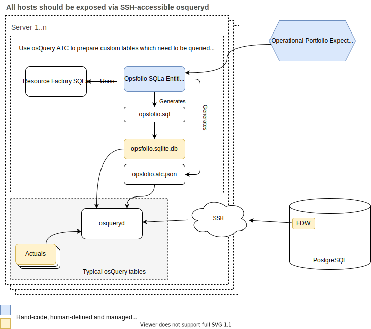

# Opsfolio Infrastructure Assurance

Opsfolio is an _infrastructure assurance_ tool to help define expectations for
assets and boundaries and then use tools like osQuery to ensure expectations are
met.

- _Expectations_ need to be established independent of tools like osQuery since
  most tools help determine the _actuals_ rather than _expectations_.
- Certain _actuals_ need to be managed by Opsfolio because most tools don't
  manage non-technical _actuals_ (such as a risk register or RACI chart).

## Dependencies

- Install `git`, `deno`, and `direnv`

## Repo initialization after clone (one time)

In order to use properly setup Git hooks, aliases, and project-specific
environment variables, run the following in the repo root after the initial
clone:

```bash
deno run -A --unstable Taskfile.ts init
direnv allow
```

The following shell aliases will be setup in `.envrc`:

- `repo-task` - run Taskfile.ts in the root of the Git repository (this is the
  one we'll use most often)
- `cwd-task` - run Taskfile.ts in the current working directory (CWD)
- `path-task` - find the first Taskfile.ts in either the current directory or
  any parent directory

See `.envrc.example` for all env vars and aliases that will be setup.

The following Git hooks will be setup:

- `.githooks/prepare-commit-msg` will make sure commit messages match
  Conventional Commits strategy
- `.githooks/pre-commit` will run `deno fmt`, `deno lint`, and `deno test`
  before commits
- `.githooks/pre-push` will run `Taskfile.ts prepare-publish` to generate docs,
  etc.

After running `Taskfile.ts init` run the `doctor` command:

```bash
repo-task doctor
```

You should see something like this:

```bash
Git repo configuration
  * .githooks setup properly
Runtime dependencies
  * deno 1.23.0 (release, x86_64-unknown-linux-gnu)
Build dependencies
  * dot - graphviz version 2.43.0 (0)
  * java 17 2021-09-14 LTS
  * PlantUML version 1.2022.6 (Tue Jun 21 13:34:49 EDT 2022)
```

If you get any error messages for `dot`, `Java`, or `PlantUML` then you will not
get auto-generated entity relationship diagrams (ERDs).

## Conventions

Opsfolio generates files using the convention `*.auto.*` which means that it's
an _auto_-generated file and should not be modified. Any file that has
`*.auto.*` in the file means that it will be deleted and recreated whenever
necessary.

## Unit Tests

Until better documentation is available, the best way to learn about Opsfolio is
to review and run the unit tests (`mod_test.ts`). You can run the following in
the base directory:

```bash
deno test -A --unstable
```

The unit tests auto-generate all files, deploy a SQLite database, and then
execute `osqueryi` to validate ATCs. By default, OPSFOLIO_UT_CLEAN_ARTIFACTS is
set to true but you can turn it off if you want to retain the generated
artifacts after testing completed:

```bash
OPSFOLIO_UT_CLEAN_ARTIFACTS=false deno test -A --unstable
```

If you use `OPSFOLIO_UT_CLEAN_ARTIFACTS=false` you'll see the following files
after `deno test`:

- `opsfolio.auto.sqlite.db` is the SQLite database that will be automatically
  integrated into `osqueryi` through ATCs; it's referred to in the
  `opsfolio.auto.osquery-atc.json` config files and indirectly used by osQuery.
- `opsfolio.auto.osquery-atc.json` is the osQuery ATC config that will allow
  integration of `opsfolio_*` tables into osQuery; this file is directly used by
  osQuery.
- `opsfolio.auto.puml` is a PlantUML Information Engineering ("IE") that can be
  used to generate an entity-relationship diagram (ERD); this file is not used
  by osQuery, it's just to enhance understanding and describe the schema.
- `opsfolio.auto.sql` is the SQL file that was used to create
  `opsfolio.auto.sqlite.db` (check the `INSERT INTO` statements to see what data
  is available); this file is not used by osQuery, it's only used to create the
  SQLite database file (`opsfolio.auto.sqlite.db`)

## Development Sandbox

Opsfolio Core uses Resource Factory remote URL-based modules. In most cases you
do not need a local RF but if you are doing development with Resource Factory
locally you will need to do the following so that `deps.ts` refers to your local
path:

```bash
repo-task prepare-sandbox
```

Before you commit/push back to GitHub, though, you will need to run
`prepare-publish` to reset `deps.ts` back to remote URLs:

```
repo-task prepare-publish
# do commits, etc.
# git semtag final
# git push
```

## osQuery ATC Database Deployment

Opsfolio uses osQuery's
[Automatic Table Construction (ATC)](https://osquery.readthedocs.io/en/stable/deployment/configuration/#automatic-table-construction)
feature to register new `opsfolio_*` tables. Once `deno test` is used, a SQLite
database is created along with `opsfolio.auto.osquery-atc.json` which registers
the Opsfolio tables so that they can be used via `osqueryi` or other osQuery
interfaces.

```bash
# generate the artifacts and test automatically, but don't delete the artifacts
OPSFOLIO_UT_CLEAN_ARTIFACTS=false deno test -A --unstable

# test the artifacts manually
osqueryi --config_path ./opsfolio.auto.osquery-atc.json "select code, value from opsfolio_execution_context"
```

Once you run `osqueryi` you should see the following output if the osQuery ATC
configuration and database were properly deployed:

```
+------+-------------+
| code | value       |
+------+-------------+
| 0    | DEVELOPMENT |
| 1    | TEST        |
| 2    | PRODUCTION  |
+------+-------------+
```

If you get `Error: no such table: opsfolio_execution_context` when you run
`osqueryi` try running with `--verbose` flag:

```bash
osqueryi --verbose --config_path ./opsfolio.auto.osquery-atc.json "select code, value from opsfolio_execution_context"
```

Look for lines like this:

```
...auto_constructed_tables... Removing stale ATC entries
                          ... ATC table: opsfolio_execution_context Registered
                          ... ATC table: opsfolio_asset_risk_type Registered
```

## Implementation Strategies

- Opsfolio uses [Resource Factory](https://github.com/resFactory/factory)
  [SQLa](https://github.com/resFactory/factory/tree/main/lib/sql/render) to
  create osQuery
  [Automatic Table Construction](https://osquery.readthedocs.io/en/stable/deployment/configuration/)
  configurations. See
  [this article](https://blog.kolide.com/build-custom-osquery-tables-using-atc-ab112a30674c)
  and
  [this gist](https://gist.github.com/FritzX6/0aa5b25e9caa232103091de31b9f5295)
  for elaboration.
- osQuery fleet management via PostgreSQL FDW façade. The Opsfolio FDW uses
  osQuery remote APIs to perform distributed queries, provide `osqueryd`
  configurations to the fleet, and provide PostgreSQL simulated tables for
  scheduled queries (packs). What we’re trying to do is to use existing open
  source tools that can be wrapped in FDWs to manage a fleet of osQuery servers.
  Basically, creating something SPG or Kolide Fleet except built entirely on top
  of PostgreSQL, FDWs, and tools like Grafana or Metabase that can sit on top of
  PG. The custom FDW would use existing osqueryd remote API to send and receive
  query data and allow anything that can read from PG to be able to collect
  osQuery data.



## Information Models

- **Graph**. This is the top-level "assets graph" which is considered the _root
  node_
  - **Boundary**. Each Graph contains one or more asset boundaries (e.g. a VLAN,
    a Container, etc.). Boundaries can contain one or more boundaries within it
    and also at multiple nested levels.
    - **Sub Boundary**. (Optional) Boundaries can contains one or more children
      (Sub Boundary) hierarchically.
    - **Category**. A similar group of assets can be classified into a Category
      and assigned to one or more boundaries. That is, categories can be defined
      independent of boundaries (e.g. a "Category Catalog") and then assigned to
      one more boundaries. Boundaries can contain one or more categories of
      assets.
      - **Sub Category** (optional). Categories can have sub-categories of
        assets hierarchically.
        - **Asset**. This is the main node and is where most of the activities
          occur.
- **Label**. A label can be applied across graph structures to allow
  non-hiearachical grouping. While categories imply ownership (e.g. "belongs to"
  relationships), labels imply more generalized associations.
- **Context**. A _context_ is similar to a label but it is specialized to allow
  depiction of environments such as dev/test/stage/prod/etc.

## Visualizing Entity-Relationship Diagrams (ERDs) using PlantUML in VS Code

To preview `*.puml` PlantUML-based Information Engineering (IE) ERDs in VS Code,
you'll need to:

- Install the
  [PlantUML VS Code (jebbs.plantuml)](https://marketplace.visualstudio.com/items?itemName=jebbs.plantuml)
  extension
- Install Graphviz `dot` executable
- Install Java JRE

To setup Graphviz:

```bash
sudo apt-get update && sudo apt-get install graphviz
```

To install Java (you can use any version, below are just examples):

```bash
asdf install java oracle-17
asdf global java oracle-17
whereis java
```

Add the following to your `bash_profile` and restart VS Code so that it will
pick up the location of Java and any other ASDF-based executables:

```bash
export PATH=$PATH:$HOME/.asdf/shims
```
